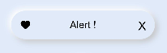

# Neumorphism_Alert
一Neumorphism Alert design for OpenHarmony.

## Download & Install

Install using npm inside pages directory

```npm init -y```

```npm i hmos-neumorphism ```

Details about OpenHarmony NPM environment configuration, see at [here](https://gitee.com/openharmony-tpc/docs/blob/master/OpenHarmony_npm_usage.md)

## Usage Instructions
# Note :

Add this css snippet when passing input or button through slot .

```css
button, input{
    width: 100%;
    height: 100%;
    background-color:transparent;
    color: black;
}
```


# Alert



Import:
```html
<element name='neualert' src='hmos-neumorphism/alert/alert.hml'></element>
```

Usage:
```html
<neualert icon="common/icons/heart.png" width="300px" height="60px" border="40px" >
  <text>Alert !</text>
</neualert>
```

## Code Contribution
If you find any problems during usage, you can submit an [Issue](https://gitee.com/openharmony-sig/Alert/issues) to us. Of course, we also welcome you to send us [PR](https://gitee.com/openharmony-sig/Alert/pulls).

## Open source License
This project is based on [Apache License 2.0](https://gitee.com/openharmony-sig/Alert/blob/master/LICENSE.txt) ，please enjoy and participate in open source freely.

# Reference:

<a href="https://neumorphism.io/">neumorphism.io</a>

<a href="https://ismail9k.github.io/neomorphism/">ismail9k.github.io/neomorphism</a>
